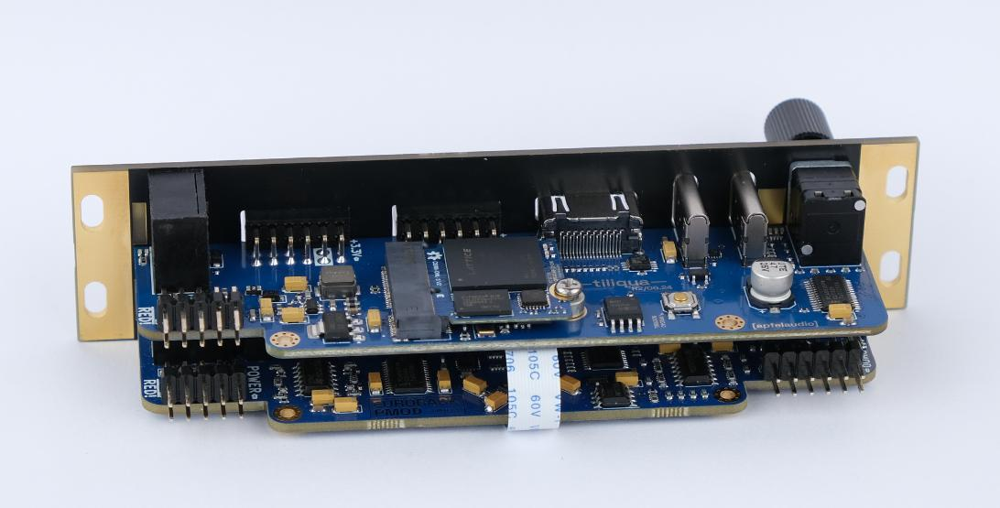

# Tiliqua

<sup>WARN: 🚧 under construction! 🚧 - this module is in active development</sup>

**[Tiliqua](https://en.wikipedia.org/wiki/Blue-tongued_skink) is a powerful, open hardware FPGA-based audio multitool for Eurorack.**

For updates, subscribe to the [Crowd Supply page](https://www.crowdsupply.com/apfelaudio/tiliqua) and my own [mailing list](https://apfelaudio.com/)


## Hardware

#### Audio Interface
- 8 (4 in + 4 out) DC-coupled audio channels, 192 KHz / 24-bit sampling supported
- Touch and proximity sensing on all 8 audio jacks (if unused)
- PWM-controlled, user-programmable red/green LEDs on each audio channel
- Jack insertion detection on all 8 jacks

#### Motherboard
- Switched rotary encoder with bar graph display.
- Dual USB ports:
    - `dbg`: Included RP2040-based JTAG debugger supported by `openFPGAloader`
    - `usb2`: USB PHY connected directly to FPGA for high-speed USB Audio support
- Display output for video synthesis (maximum resolution 720/60P)
- 2x expansion ports for up to 24 simultaneous audio channels (PMOD-compatible)
- MIDI-In jack (TRS-A standard)

#### Embedded FPGA SoM (`soldiercrab`)

- Lattice ECP5 (25 K) FPGA, supported by open-source FPGA toolchains
- 128 Mbit (16 MByte) HyperRAM / oSPI RAM (for long audio buffers or video framebuffers)
- 128 Mbit (16 MByte) SPI flash for user bitstreams
- High-speed USB HS PHY (ULPI)

## Where do I get a Tiliqua?

Tiliqua will launch on [Crowd Supply](https://www.crowdsupply.com/apfelaudio/tiliqua). Subscribing there is the best place to get production updates.



# Getting Started (hardware beta R2)

## Connecting

Tiliqua uses an ordinary 10-pin power cable for +/- 12V ingress. You will notice however, that there are 2 such connectors on the module. *Only ONE of these should be connected*:

- Use the 10-pin power ingress on the Tiliqua Motherboard, not the Audio Interface Board. Technically both will work, but only the former is fused (on beta R2 units).
- Both connectors on the audio interface board (`eurorack-pmod`) should remain unconnected.

For flashing bitstreams, usually you want to be connected to the `dbg` USB port. This is directly connected to the on-board RP2040 which is flashed with `dirtyJtag`, such that you can flash bitstreams using `openFPGALoader`.

Particularly for bitstreams with touch sensing, ensure all jacks are disconnected when the tiliqua is powered on. This is because the capacitive sensing is calibrated when the system boots. In the future I'll change this to happen every time something is dis/re-connected.

# Getting Started (gateware/firmware)

## Prerequisites

On an Ubuntu system, the following are the main dependencies:
- The build system: install [pdm](https://github.com/pdm-project/pdm)
- For synthesis: install [oss-cad-suite](https://github.com/YosysHQ/oss-cad-suite-build)
- For examples that include a softcore: [rust](https://rustup.rs/).
    - To build stripped images for RISC-V, you also need:
        - `rustup target add riscv32imac-unknown-none-elf`
        - `rustup component add rustfmt clippy llvm-tools`
        - `cargo install cargo-binutils svd2rust form`

To set up the environment:
```bash
cd gateware
git submodule update --init --recursive
pdm install
```

## Building example projects

Each top-level bitstream has a command-line interface. You can see the options by running (for example):

```bash
# from `gateware` directory
pdm dsp
```

The available options change depending on the top-level project. For example, many projects have video output, and from the CLI you can select the video resolution.

A few examples of building top-level bitstreams:
```bash
# from `gateware` directory

# for the selftest bitstream (prints diagnostics out DVI and serial)
pdm selftest build
# for a vectorscope / oscilloscope
pdm xbeam build
# for a polyphonic MIDI synth
pdm polysyn build
# for the LUNA-based 4in + 4out USB soundcard example
# note: LUNA USB port presents itself on the second USB port (not dbg)!
pdm usb_audio build
# for a 4-channel waveshaping oscillator
pdm dsp build --dsp-core nco
# for a diffusion delay effect
pdm dsp build --dsp-core diffuser
# simplified vectorscope (no SoC / menu system)
pdm vectorscope_no_soc build
```

Generally, bitstreams are also built in CI - check `.github/workflows` if you need more gruesome details on how systems are built.

## Flashing example projects

The built-in RP2040 JTAG debugger is based on the `dirtyJtag` project. You can flash the bitstreams above to the SRAM of the FPGA like so (add an `-f` to instead flash it to SPI flash permanently):

```bash
sudo openFPGALoader -c dirtyJtag build/top.bit
```

If you are running an SoC, it will give you serial output that you can monitor like so:

```bash
sudo picocom -b 115200 /dev/ttyACM0
```

## Simulating DSP cores

The easiest way to debug the internals of a DSP project is to simulate it. This project provides some shortcuts to enable simulating designs end-to-end with Verilator (at some point these will be migrated to Amaranths CXXRTL simulation backend, once it lands).

For example, to simulate the waveshaping oscillator example:

```bash
# from `gateware` directory
pdm dsp sim --dsp-core nco
```

In short this command:
- Elaborates your Amaranth HDL and convert it to Verilog
- Verilates your verilog into a C++ implementation, compiling it against `sim_dsp_core.cpp` provided in `gateware/top/dsp` that excites the audio inputs (you can modify this).
- Runs the verilated binary itself and spits out a trace you can view with `gtkwave` to see exactly what every net in the whole design is doing.

## Simulating SoC cores

A subset of SoC-based top-level projects also support end-to-end simulation (i.e including firmware co-simulation). For example, for the selftest SoC:

```bash
# from `gateware` directory
pdm selftest sim

# ...

run verilated binary 'build/obj_dir/Vtiliqua_soc'...
sync domain is: 60000 KHz (16 ns/cycle)
pixel clock is: 74250 KHz (13 ns/cycle)
[INFO] Hello from Tiliqua selftest!
[INFO] PSRAM memtest (this will be slow if video is also active)...
[INFO] write speed 1687 KByte/seout frame00.bmp
c
[INFO] read speed 1885 KByte/sec
[INFO] PASS: PSRAM memtest
```

UART traffic from the firmware is printed to the terminal, and each video frame is emitted as a bitmap. This kind of simulation is useful for debugging the integration of top-level SoC components.

## Simulating vectorscope core

There is a top-level `vectorscope_no_soc` provided which is also useful for debugging integration issues between the video and memory controller cores. This can be simulated end-to-end as follows (`--trace-fst` is also useful for saving waveform traces):

```bash
# from `gateware` directory
pdm vectorscope_no_soc sim --trace-fst
```

## Using the ILA

Some cores support using a built-in ILA (integrated logic analyzer), to collect waveform traces on the hardware into on-FPGA block RAM, which is sampled at the system clock and dumped out the serial port.

For example:
```bash
# from `gateware` directory
pdm vectorscope_no_soc build --ila --ila-port /dev/ttyACM0
```

This will build the bitstream containing the ILA, flash the bitstream, then open the provided serial port waiting for an ILA dump from the Tiliqua to arrive. Once recieved, the dump will be saved to a waveform trace file.

Note: you may have to play with permissions for flashing to work correctly - make sure `openFPGALoader` can run locally under your user without `sudo`.

## Builds on the following (awesome) open-hardware projects
- Audio interface and gateware from my existing [eurorack-pmod](https://github.com/apfelaudio/eurorack-pmod) project.
- USB interface and gateware based on [LUNA and Cynthion](https://github.com/greatscottgadgets/luna/) projects.
- USB Audio gateware and descriptors based on [adat-usb2-audio-interface](https://github.com/hansfbaier/adat-usb2-audio-interface).

# License

The hardware and gateware in this project is largely covered under the CERN Open-Hardware License V2 CERN-OHL-S, mirrored in the LICENSE text in this repository. Some gateware and software is covered under the BSD 3-clause license - check the header of the individual source files for specifics.

**Copyright (C) 2024 Sebastian Holzapfel**

The above LICENSE and copyright notice do NOT apply to imported artifacts in this repository (i.e datasheets, third-party footprints), or dependencies released under a different (but compatible) open-source license.
