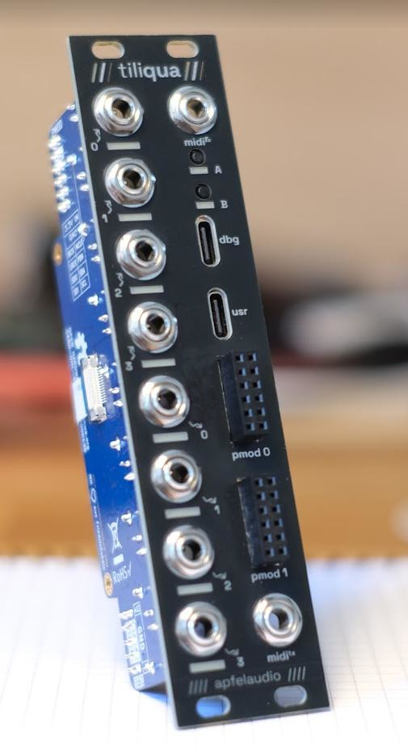
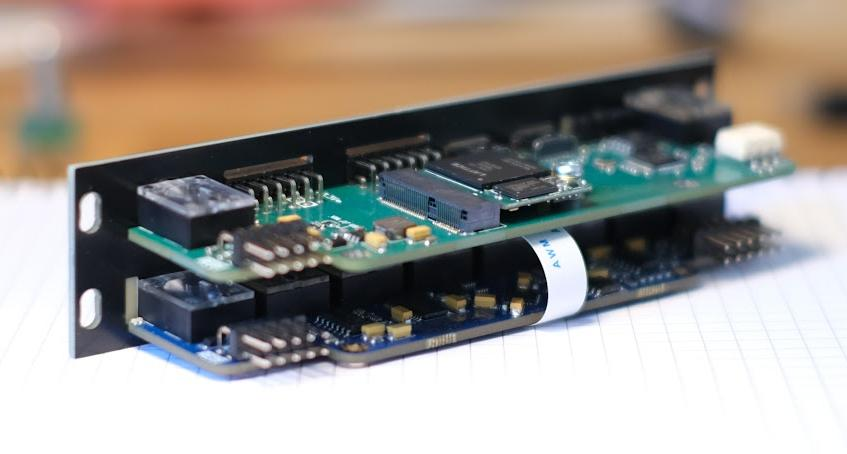

# `tiliqua`

<sup>WARN: 🚧 under construction! 🚧 - this module is in active development</sup>

**[Tiliqua](https://en.wikipedia.org/wiki/Blue-tongued_skink) is a powerful, hackable FPGA-based audio multitool for Eurorack.**



## Technical
- Based on Lattice ECP5 FPGA, supported by open-source FPGA toolchains.
- 128MBit SPI flash + 128MBit HyperRAM (for long audio buffers!)
- USB C `usr`: USB2 PHY connected directly to FPGA for high-speed USB Audio support.
- USB C `dbg`: Included RP2040-based JTAG debugger.
- MIDI IN + MIDI OUT jacks.
- 8 (4 in + 4 out) DC-coupled audio channels, 192KHz / 32bit sampling supported.
- Touch and proximity sensing on all unused audio jacks (8 max).
- PWM-controlled, user-programmable red/green LEDs on each audio channel.
- Jack insertion detection on input & output jacks.
- 2x expansion ports (PMOD compatible) for up to 24 simultaneous audio channels (with extra eurorack-pmods).



## Where do I get a Tiliqua?

TODO

## Building and running demo projects

For the `example-usb-audio` project for on an Ubuntu system, first make sure you have [pdm](https://github.com/pdm-project/pdm) installed. Then:

```bash
cd gateware/example-usb-audio
pdm install
pdm run build_tiliqua
```

All examples are also built in CI - check `.github/workflows` if you need more gruesome details on how systems are built.

## Builds on the following (awesome) open-hardware projects
- Audio interface and gateware from my existing [eurorack-pmod](https://github.com/apfelaudio/eurorack-pmod) project.
- USB interface and gateware based on [LUNA and Cynthion](https://github.com/greatscottgadgets/luna/) projects.
- USB Audio gateware and descriptors based on [adat-usb2-audio-interface](https://github.com/hansfbaier/adat-usb2-audio-interface).

# License

The hardware and gateware in this project is largely covered under the CERN Open-Hardware License V2 CERN-OHL-S, mirrored in the LICENSE text in this repository. Some gateware and software is covered under the BSD 3-clause license - check the header of the individual source files for specifics.

**Copyright (C) 2024 Sebastian Holzapfel**

The above LICENSE and copyright notice do NOT apply to imported artifacts in this repository (i.e datasheets, third-party footprints), or dependencies released under a different (but compatible) open-source license.
